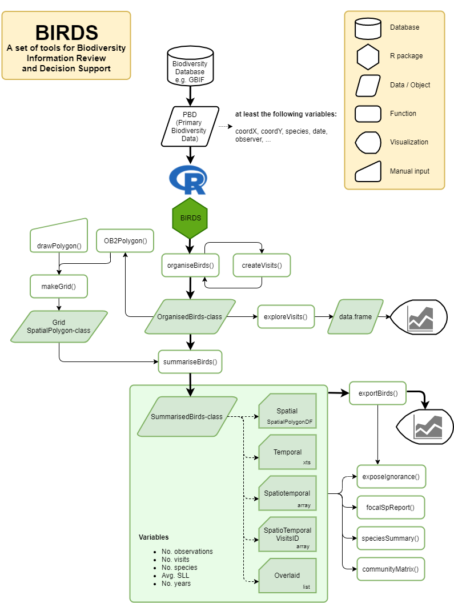
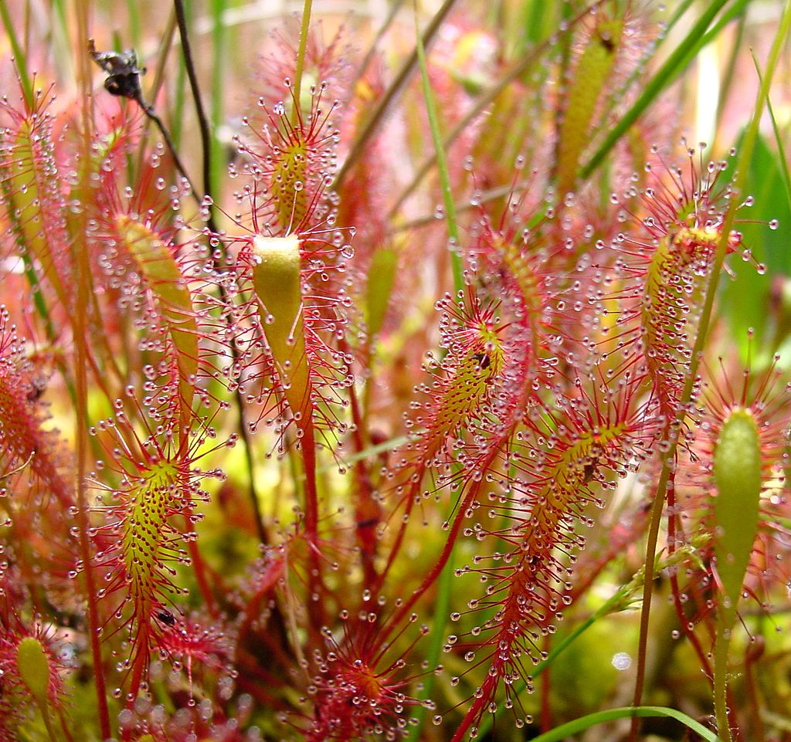

```{r setup, include=FALSE}
knitr::opts_chunk$set(echo = TRUE)
library(rgbif)
library(rinat)
library(NBN4R)
library(ggplot2)
library(dplyr)
library(lubridate)
library(BIRDS)
library(sp)
library(sf)
```

# What is Biodiversity Information Review & Decision Support (BIRDS)?
You have already seen how to download citizen science data from a variety of databases, and identified some of the problems that may occur. But how do you know whether the citizen science data is "fit-for-use" for subsequent visualisation and modelling? `BIRDS` is an R package that will help you identify potential under- or over-reporting of species in particular areas, detect anomalous records etc. as well as help you in your decision-making when using citizen science data.

This practical aims to provide an overview of some of the basic functionality of BIRDS, and some typical workflows, using data from the NBN Atlas dataset. Note that despite its name, BIRDS can be used on any taxonomic group! The concepts behind BIRDS were originally published in three papers over the last 20 years, although the package itself is very new:

* Ruete A. (2015) Displaying bias in sampling effort of data accessed from biodiversity databases using ignorance maps. Biodiversity Data Journal <https://doi.org/10.3897/BDJ.3.e5361>
* Szabo J.K. _et al_ (2010) Regional avian species declines estimated from volunteer-collected long-term data using List Length Analysis. Ecological Applications <https://doi.org/10.1890/09-0877.1>
* Tefler M.G. _et al_ (2002) A general method for measuring relative change in range size from biological atlas data. Biological Conservation <https://doi.org/10.1016/S0006-3207(02)00050-2>

# Advantages and disadventages of BIRDS
The BIRDS package won a prize in 2019 for best use of Citizen Science data from the Global Biodiversity Information Facility (GBIF). It is being actively developed, and I expect to see continued improvments in the software. Unfortunately the documentation and online tutorials are still incomplete or minimal in many places, and some function names have slightly inconsistent syntax. It creates spatial data, but currently uses the older `sp` R spatial library, not the newer `sf` library, although it is in the process of being updated to become compatible with the latter.

## BIRDS workflow
The following diagram gives a summary of a possible workflow with BIRDS.



In other words, it provides a means of going from the original data held on the Citizen Science database, through to creating various reports to identify patterns in space and time in the records, gaps in knowledge etc.

# Getting started with BIRDS
Begin by installing and loading the BIRDS package in the usual way with `install.packages("BIRDS")`. Note that it will auto-install various other packages at the same time. Please load the BIRDS library, as well as several other useful ones, such as `NBN4R` to get the data, the `sp` and `sf` packages for handling spatial information, and the `lubridate` package for handling dates and times.

```{r, eval=FALSE}
library(BIRDS)
library(NBN4R)
library(sp)
library(sf)
library(lubridate)
```

# Four key concepts
## 1. Field visit
A central concept used by the `BIRDS` package is the “visit” – defining the sampling unit as a sampling event by a unique observer (or group of observers), at a unique unit of space and time (commonly a day). Visits can help us to summarize the amount of effort expended in the field. During a visit, the observer commonly samples (i.e. observes and records) species by similar methods. The sampling effort can vary among visits, with the amount of effort expended being greater when spending more time, and reporting more of the observed species. The same number of observations (records of species) at a unique unit of time and space could be made by either few observers reporting many species (greater effort by each observer) or many observers reporting few species (small effort by each observer). Using visits as sampling units allows separation of sampling effort into the effort that can be expressed through the number of visits by different observers and the effort per visit (e.g. species list length, or when available the time spent during a visit). Hence, the quality (completeness) of the data can be judged by using information for each visit and information from a collection of visits.

## 2. Spatial grid and spillover
Defined by a unique observer (or group of observers), at a unique unit of space and time visits can be identified by a unique combination of variables: observer id, location, time. Often location is a named unit of space that has been visited during the same sampling event. For example a botanist visiting and reporting species for a meadow, or a bird watcher visiting and reporting species for a lake.

Sometimes locations can be more accurate positions for individuals of species that have been observed and reported during the same field visit. The botanist may have visited the meadow but reported species from a number of different sampling points in that meadow. Or the bird watcher reported species for different parts of the lake. In that case there is no common spatial identifier for the visit.

If there is no common spatial identifier to define the visit extent, and the observer id is not enough to constrain observations spatially (e.g. group of observers from organisation where observer id = organisation name), then visits can be created when overlaying the observation data with the spatial grid. A visit is then defined as all the observations falling into the same grid cell. It is important to keep in mind to choose a grid with a cell size that corresponds to (or at least is not smaller than) the average spatial extent known (or assumed) to be typical for field visits for the reference species group (see below). This process can be repeated with a set of grids with different offset to explore the sensitivity of the results to the size of the grid cells.

## 3. Reference species group
One assumption is that the multiple species that you investigate could all be sampled by the same method. So a "reference species group" might be Coccindellidae (Ladybirds), which are all sampled in a similar way by members of the public when they do their surveying. Bumblebees, primarily belonging to the genus _Bombus_, could be another reference species group. It would not be appropriate to pick something like Lepidoptera as a reference species group as this is too broad: this insect Order includes both butterflies and moths. Many of the latter are only active at night, and are sampled using very different techniques. In this example we will look at one genus of plants, which have similar habitat requirements.

## 4. Species list length (SLL)
The SLL per visit (i.e. the number of species observed and recorded per visit) is a well known proxy for the time spent in the field and willingness to report all species seen of a reference taxonomic group, Szabo et al. 2010). The BIRDS package therefore uses SLL as a proxy for sampling effort.

# Example: sundews _Drosera_ in Scotland
As our example to demonstrate how to use BIRDS, we will look at Citizen Science data on fly-catches or sundews, in Scotland. Sundews belong to the genus _Drosera_ and there are several different species in the UK. They tend to occur in upland bogs, where the soil is poor in nitrogen and other key nutrients, and the plants have evolved sticky hairs on their leaves with which to catch insects, and in thus increase their supply of nutrients.



We'll begin by downloading data from the National Biodiversity Network Atlas on _Drosera_ records:

```{r, eval=FALSE}
nbn_config(caching="off")
drosera_nbn <- ALA4R::occurrences(taxon="Drosera",
                                  download_reason_id=4,
                                  verbose=TRUE,
                                  email="your.email@newcastle.ac.uk")

# If the download fails, use GBIF, or this drosera_nbn.RDS file from Canvas
# drosera_nbn <- readRDS("drosera_nbn.RDS")
```

```{r, echo=FALSE}
# nbn_config(caching="off")
# drosera_nbn <- ALA4R::occurrences(taxon="Drosera anglica", download_reason_id=4,
#                                  verbose=TRUE,
#                                  email="your.email@newcastle.ac.uk")
drosera_nbn <- readRDS("drosera_nbn.RDS")
```

Remember that the downloaded data is in the form of an R "list", with two sections in it, `$data` and a `$meta` section, with additional information about sources. For example type `View(drosera_nbn$meta$citation)` to see information about the recording schemes. You can check the scientific names with:

```{r}
unique(drosera_nbn$data$scientificName)
```

and you can see that there are several species, some hybrids, and some records only recorded to genus-level. To make subsequent analyses easier, we'll put the `drosera_nbn$data` dataframe into a dataframe of its own, so that you no longer have to use multiple `$` symbols to address a list structure. We'll call it `PBD` to indicate "primary biodiversity data" which is the syntax used by BIRDS. We'll then clean up the data, to:

* remove records without longitude or latitude information
* remove records without information on the recording date
* remove records without information about the locality (used by BIRDS)
* remove records without information on the recorder (again, this is used by BIRDS)
* keep records identified to the `rank` of species, and not merely genus
* keep records from 1970 onwards. We  Some records go back to the 19th century, and they are likely to skew our analyses.

In the lines of code below, remember that

* `!` represents "not"
* `|` represents "or"
* `!=` represents "not equal"
* `==` represents "equals"
* `>=` represents "greater than or equals"

Note that before the closing square bracket there is a comma `,]` to indicate that all columns in the dataframe should be retained:

```{r}
PBD <- drosera_nbn$data
PBD <- PBD[!is.na(PBD$longitudeWGS84) | !is.na(PBD$latitudeWGS84) ,]
PBD <- PBD[PBD$startDate != "" ,]
PBD <- PBD[PBD$locality  != "" ,]
PBD <- PBD[PBD$recorder  != "" ,]
PBD <- PBD[PBD$rank      == "species" ,] # This can be done via organizeBirds
PBD <- PBD[PBD$startDateYear >= 1970 ,]
```

# Field visits and the OrganizedBirds class
A central concept in BIRDS is what is known as an `OrganizedBirds` class. This makes it easier to assess visits by the same or different observers over time to different sites or localities. Hence, when we cleaned the data, we had to ensure that localities and recorder information was available. A “visit” define the sampling unit as a sampling event by a unique observer (or group of observers), at a unique unit of space and time (commonly a day). Visits can help us to summarize the amount of effort expended in the field. During a visit, the observer commonly samples (i.e. observes and records) species by similar methods. The sampling effort can vary among visits, with the amount of effort expended being greater when spending more time, and reporting more of the observed species. The same number of observations (records of species) at a unique unit of time and space could be made by either few observers reporting many species (greater effort by each observer) or many observers reporting few species (small effort by each observer). Using visits as sampling units allows separation of sampling effort into the effort that can be expressed through the number of visits by different observers and the effort per visit (e.g. species list length, or when available the time spent during a visit). Hence, the quality (completeness) of the data can be judged by using information for each visit and information from a collection of visits.

To create our `OB` object simply use the `organizeBirds()` function. By default quite a lot of information is printed to screen as it processes the data, but don't worry about that. 

```{r, results="hide"}
OB <- organizeBirds(PBD,
                    sppCol = "scientificName",
                    simplifySppName = TRUE,  # Removes authors and years etc.
                    idCols = c("locality", "recorder"),
                    xyCols = c("longitudeWGS84", "latitudeWGS84"),
                    timeCols = "startDate")
```

We can then create a 25km grid for Scotland on which to explore the data; this should be the maximum sized area that a person might explore in a day (this differs for different taxonomic groups). By default it is set at 10 km, but as this will slow down calculations for a large area like Scotland, I'll slightly increase it to 25km which is still not unrealistic. 

```{r}
gb_ll_sf <- readRDS("gb_simple.RDS")
scot_ll_sf <- gb_ll_sf[2,]  # Scotland is coded number 2 in the GB map used
scot_ll_sp <- as_Spatial(scot_ll_sf) # Expects polygon in sp rather than sf format

scot_grid <- makeGrid(scot_ll_sp, 25)
plot(scot_grid)
```

You can see that it actually creates by default a series of **hexagonal** grids packed together, which gives an attractive visualisation when analysing the species occurence data. If you want square grids, then give the option `hexGrid = FALSE`. You can then summarise the `OB` object against this grids to show how the number of visits varies. Records in England and Wales are omitted:

```{r}
SB <- summariseBirds(OB, grid=scot_grid)
```

Once you have obtained this summarised data object `SB` you can then interrogate it, for example using `exposeIgnorance()` to highlight any areas of particular concern (there are none in this case). A particularly useful function is to look at changes across years, months, and space, all in one plot for a given species:

```{r}
all_species <- listSpecies(SB)
all_species
focal_species <- all_species[1] # Let's pick Drosera anglica
focalSpReport(SB, focalSp=focal_species)
```

The map shows the hexagons that were visited, shaded according to whether the _Drosera anglica_ was detected. Note that not all hexagons are present (compare with earlier map), in that a small number were not visited at all. You can also obtain useful information about how long, and over how many months, each species was observed in tabular form:

```{r, eval=FALSE}
drosera_summary <- speciesSummary(SB)
View(SB)
```

You can export information from your `SB` object to plot changes over time. For example, a useful static is the number of observations relative to the number of visits, which we will sum for each year:

```{r}
# Look at some summarised variables:
# Number of observations
EBnObs <- exportBirds(SB, dimension = "temporal", timeRes = "yearly", 
                      variable = "nObs", method = "sum")
# Number of visits
EBnVis <- exportBirds(SB, dimension = "temporal", timeRes = "yearly", 
                      variable = "nVis", method = "sum")
# The ratio of number of observations over number of visits
relObs <- EBnObs/EBnVis
```


```{r}
# Average species list length (SLL) per year (a double-average, i.e. the mean 
# over cell values for the median SLL from all visits per year and cell) 
EBavgSll <- colMeans(SB$spatioTemporal[,,"Yearly","avgSll"], na.rm = TRUE)

# Set the result to a time-series object
EBavgSll <- xts::xts(EBavgSll, date(relObs))
```

Now let's create some simple plots to view patterns over time:

```{r}
# column-bind the observations and visits
obs_visits <- cbind(EBnObs, EBnVis)

# plot(obs_visits)                   # Default time-series plot
autoplot(obs_visits, facet=NULL) +   # ggplot2-compatible
  xlab("Year") +
  ylab("Observations or visits")
```

You can readily see that the numbers of observations of sundews is very highly correlated with the numbers of visits made to the locations across Scotland over time. This is easy to confirm by scaling the number of observations divided by the number of visits, and checking that this is relatively constant over time:

```{r}
autoplot(relObs) +
  xlab("Year") +
  ylab("Relative observations by visit")
```

You can see that other than a slight peak around 1990 and 1992, the numbers of observations per visit have remained relatively constant over time. Now let's look at the average species list length per cell:

```{r}
autoplot(EBavgSll) +
  xlab("Year") +
  ylab("Average species list length per cell ")
```

This is quite a small dataset (deliberately, to speed up data processing for you), so keep in mind that there are only 6 species of _Drosera_ in the dataset, of which only two a widespread. Therefore, don't be suprised that the average species list length is low. What matters are changes over time, and you can see that this is generally increasing, which is good. Ignore the sudden drop-off in 2019-20, suggesting the most recent datasets have not been fully uploaded.

## Mapping frequency with which areas were visited
Next, let's create some maps across Scotland to show which grid cells were visited, and the number of years in which samples were taken in July compared to December. You can see from the earlier plots that (as might be expected) most samples were in the summer. How is this pattern showing spatially?

```{r}
# Identify gridcells which have no records. A bit complicated a the SB
# object is an R "list" structure.
wNonEmpty<-unname( which( unlist(lapply(SB$overlaid, nrow)) != 0) )

# Plot Scotland in light grey
plot(scot_ll_sp, col="grey90", border = "grey90", lwd=1)
# Plot records in darker gray
plot(SB$spatial[wNonEmpty,], col="grey", border = NA, add=TRUE)
```

You can see that most of Scotland has been surveyed according to the dataset. Now let us extract the information on a monthly basis for the total number of years (sum) of visits to each cell.

```{r}
# Export single variables from SummarisedBirds object. Here we want the total 
# number of years, nYears, for each cell, with information broken down by
# month.
EB <- exportBirds(SB,
                  dimension = "Spatial",
                  timeRes = "Month",
                  variable = "nYears", # nObs, nVis, nSpp, nDays, AvgSll options
                  method = "sum")      # sum, medain, mean options
```

We'll use the `colorNumeric()` function to create some attractive colours. This takes the name of a palette, as either a range of named colours, or a single colour name; here we will do shades of blue. It also needs to know the `domain` to work in, i.e. the minimum to maximum numeric values it will work with. The `colorNumeric()` function actually generates another function, which here we are calling `palBW()`. If you give this function a number, it will return a cryptic R colour code.

```{r}
# Create a nice looking colour palette from white to navy blue
palBW <- leaflet::colorNumeric(palette = "Blues",
                               domain = c(0, max(EB@data, na.rm = TRUE)) )
# Create a sequence of 5 numbers from 0 to max number of years
yrCnts <- seq(0, max(EB@data, na.rm = TRUE), length.out = 5)
```

Here, the `yrCnts` gives the values from 0 to 22, which is the maximum number of years. If you display both you will see how `palBW()` "translates" these into colour codes that you can use in a legend:

```{r}
yrCnts
palBW(yrCnts)
```

The cryptic codes with `#` symbols are the colour codes used internally by R. Now go ahead to plot your two maps side-by-side:

```{r, eval=FALSE}
# Set plot window to 1 row and 2 columns
par(mfrow=c(1,2))

# July data
# Plot Scotland background
plot(scot_ll_sp, col="grey90", border = "grey90", lwd=1)
# Plot July visits. Give the col option the palBW function with July data
plot(EB, col=palBW(EB@data$Jul), border = NA, add=TRUE)
# Map caption
mtext("Number of years for which \nJuly was sampled", 3, line=-2)

# Plot December data in the same way
plot(scot_ll_sp, col="grey90", border = "grey90", lwd=1)
plot(EB, col=palBW(EB@data$Dec), border = NA, add=TRUE)
mtext("Number of years for which \nDecember was sampled", 3, line=-2)

# Add legend showing number of years
legend("bottomleft",                 # Position of legend (in last plot)
       legend= yrCnts,               # Numbers to use in legend
       col = palBW(yrCnts),          # Colours for legend
       title = "Number of years",    # Legend title
       pch = 15,                     # Shape of colour symbols; 15=square
       bty="n")                      # Do not draw box round legend

# Reset plot window
par(mfrow=c(1,1))
```

```{r, echo=FALSE}
# This code to produce 3 maps side-by-side
# Identify gridcells which have no records. A bit complicated a the SB
# object is an R "list" structure.
wNonEmpty<-unname( which( unlist(lapply(SB$overlaid, nrow)) != 0) )

# Export single variables from SummarisedBirds object. Here we want the total 
# number of years, nYears, for each cell, with information broken down by
# month.
EB <- exportBirds(SB,
                  dimension = "Spatial",
                  timeRes = "Month",
                  variable = "nYears", # nObs, nVis, nSpp, nDays, AvgSll options
                  method = "sum")      # sum, medain, mean options

palBW <- leaflet::colorNumeric("Blues", 
                               c(0, max(EB@data, na.rm = TRUE)))

oldpar <- par(no.readonly =TRUE)
par(mfrow=c(1,3), mar=c(1,1,1,1))
plot(scot_ll_sp, col="grey90", border = "grey90", lwd=1)
plot(SB$spatial[wNonEmpty,], col="grey", border = NA, add=TRUE)
mtext("Visited cells", 3, line=-1)

plot(scot_ll_sp, col="grey90", border = "grey90", lwd=1)
plot(EB, col=palBW(EB@data$Jul), border = NA, add=TRUE)
mtext("No. years for which \nJuly sampled", 3, line=-2)

plot(scot_ll_sp, col="grey90", border = "grey90", lwd=1)
plot(EB, col=palBW(EB@data$Dec), border = NA, add=TRUE)
mtext("No. years for which \nDecember sampled", 3, line=-2)

legend("bottomleft", 
       legend=seq(0, max(EB@data, na.rm = TRUE), length.out = 5),
       col = palBW(seq(0, max(EB@data, na.rm = TRUE), length.out = 5)),
       title = "Number of years", pch = 15, bty="n")
par(oldpar)
```

As you might expect, lots of samples in July, virtually none in December. Of course if you were looking at records of a migratory bird that over-winters in the UK, the results would be reversed!

# Create maps of "ignorance scores"
The concept of ignorance scores was developed by Ruete (2015). Ignorance scores are a proxy for the lack of sampling effort, computed by making the number of observations relative to a reference number of observations that is considered to be enough to reduce the ignorance score by half (the half-ignorance approach). The `exposeIgnorance()` function can be used to determine these values based on the either the number of observations or visits. The algorithm behind the Ignorance Score is designed to identify biases and gaps in primary biodiversity data across taxonomy, time and space, which is especially useful for Citizen Science data that may have been collected in an unstructured manner.

It is useful to display both the number of observations, and the ignorance score, which here we calculate using the visitations. First, create the colour palette based on the number of visits:

```{r, eval=FALSE}
# Create a nice colour-palette. The upper boundary is set to maximum of `nVis`
# palBW is an R function to generate sequence of colours within limits
palBW <- leaflet::colorNumeric(palette = "Blues", 
                               domain = c(0, max(SB$spatial@data$nVis, na.rm = TRUE)))
# Create sequence numbers from to 0 to max visits; 5 number groups, for legend
seqNVis <- round(seq(0, max(SB$spatial@data$nVis, na.rm = TRUE), length.out = 5))
```

Now create the visitation map, using this colour palette for legend

```{r, eval=FALSE}
# Grey background map
plot(scot_ll_sp, col="grey90", border = "grey90", lwd=1)
# Add visits
plot(SB$spatial, col=palBW(SB$spatial@data$nVis), border = NA, add=TRUE)

# Add legend
legend("bottomleft",
       legend = seqNVis,                    # Numbers used in legend              
       col = palBW(seqNVis),                # Colours used in legend
       title = "Number of \nobservations",  # Legend caption
       pch = 15,                            # Shape of colour; 15 is square
       bty="n")                             # Omit background box
```

You can see the observations quite widely scattered across Scotland, mainly central Highland region. Few observations in some of the Outer Hebrides, Orkney or Shetland Isles. Now, compare with potential ignorance using the `exposeIgnorance()` function. Here we set the half-ignorance parameter value to 5. There is sometimes a bit of trial-and-error to setting this value so as to create a map where areas of relatively high ignorance are easy to spot.

```{r, eval=FALSE}
# Extract ignorance scores. h = 5 is the half-ignorance parameter value
ign <- exposeIgnorance(SB$spatial@data$nVis, h = 5)

# Create a colour palette function, sequence, and colour codes
palBWR <- leaflet::colorNumeric(palette = c("green", "white","red"), 
                                domain = c(0, 1))
seqIgn <- seq(0, 1, length.out = 5)  # numbers 0.00, 0.25, 0.50, 0.75, 1.00
colIgn <- palBWR(seqIgn)             # convert to R colour codes
```

Now use this information to create a map of Scotland with ignorance values

```{r, eval=FALSE}
# Grey background map
plot(scot_ll_sp, col="grey90", border = "grey90", lwd=1)
# Ignorance map
plot(SB$spatial, col=palBWR(ign), border = NA, add=TRUE)

# Add legend
legend("bottomleft",
       legend=c(seqIgn, "NA"),       # Add an extra category for NA values
       col = c(colIgn, "grey90"),    # Colour NA values grey
       title = "Ignorance on nVis; \nh 0.5 = 5",
       pch = 15,
       bty="n")
```


```{r, echo=FALSE}
# Use this code to print side-by-side
oldpar <- par(no.readonly =TRUE)
par(mfrow=c(1,2), mar=c(1,1,1,1))
palBW <- leaflet::colorNumeric(c("navyblue", "white","red"), 
                               c(0, max(SB$spatial@data$nVis, na.rm = TRUE)), 
                               na.color = "transparent")
seqNVis<-round(seq(0, max(SB$spatial@data$nVis, na.rm = TRUE), length.out = 5))
plot(SB$spatial, col=palBW(SB$spatial@data$nVis), border = NA)
plot(scot_ll_sp, col=NA, border = "grey", lwd=1, add=TRUE)
legend("bottomleft", legend=seqNVis, col = palBW(seqNVis),
      title = "Number of \nobservations", pch = 15, bty="n")

ign<-exposeIgnorance(SB$spatial@data$nVis, h = 5)
palBWR <- leaflet::colorNumeric(c("green", "white", "red"), c(0, 1), 
                                na.color = "transparent")
plot(scot_ll_sp, col="grey90", border = "grey90", lwd=1)
#> Warning in wkt(obj): CRS object has no comment
plot(SB$spatial, col=palBWR(ign), border = NA, add=TRUE)
#plot(scot_ll_sp, col=NA, border = "grey", lwd=1, add=TRUE)
legend("bottomleft", legend=c(seq(0, 1, length.out = 5), "NA"),
      col = c(palBWR(seq(0, 1, length.out = 5)), "grey90"),
      title = "Ignorance \nnVis, \n0.5=5", pch = 15, bty="n")
par(oldpar)
```

You can see that the main areas with high ignorance are north-east Scotland in Aberdeenshire, and possibly south-east Scotland. Even though the outer Hebrides, Orkney and Shetland have relatively few observations, the data do seem fairly reliable from there. In contrast, we cannot be sure that the lack of records from Aberdeenshire represents a real absence of the _Drosera_. It may reflect sampling bias in the underlying Citizen Science data.
